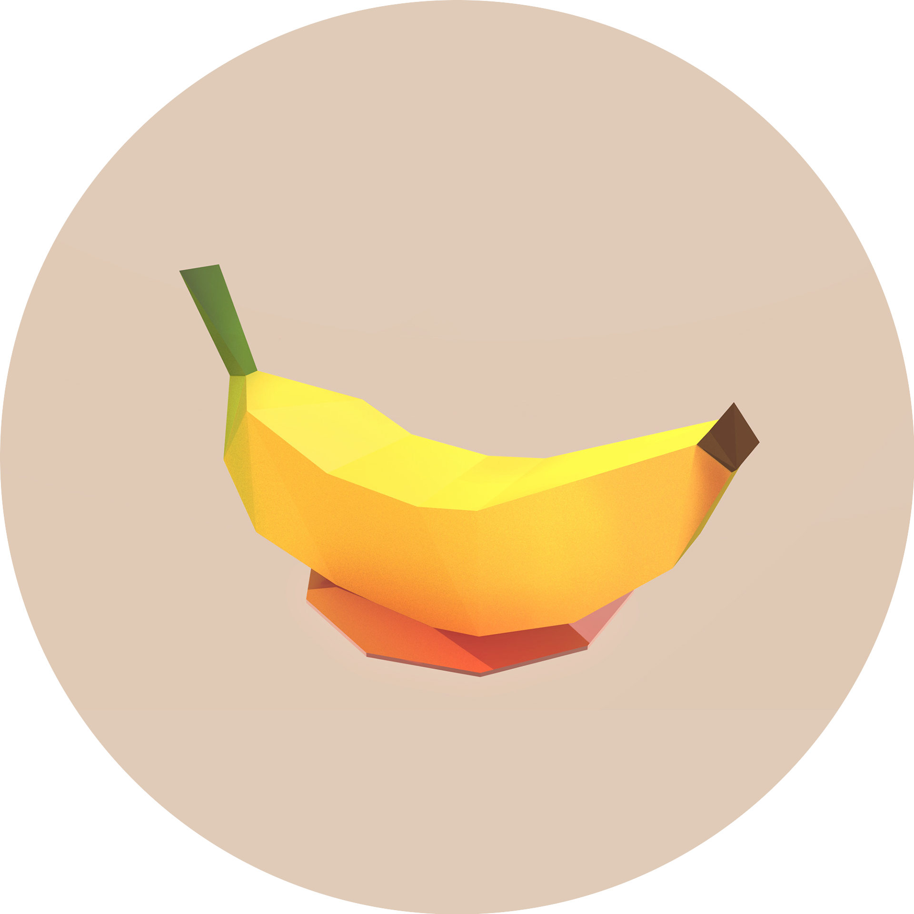

<p align="center">
  
  <h2 align="center">BinoculaRSS</h2>
</p>

BinoculaRSS (pronounced /bəˈnäkyələrz/) is a feature-rich [RSS](https://en.wikipedia.org/wiki/RSS) reader application, still currently under development. It is built using Kotlin and Jetpack Compose.

## Developer Installation

Install Android Studio, clone the project, and open the project. Follow any prompts that Android Studio gives you about installing a JDK or Android SDK.

You can choose to run the code on a physical Android device or an Android emulator.

### Physical Device

Ensure that ADB is installed. This is so that Android Studio can communicate with your phone. You will need to activate developer mode. For instructions on how to install ADB, see the following [article](https://www.xda-developers.com/install-adb-windows-macos-linux/#adbsetup).

1. Enable developer mode:
   - Go into `About this Phone`.
   - Find the `Build Number` heading, and click on it until a toast message pops up saying something along the lines of `You are a developer`.
2. Go into developer settings (location varies by device), and enable `USB Debugging`.
3. In Android Studio select the `APP` build configuration, select your device from the device drop down, and press the run button.

### Emulator

Ensure that ADB is installed. This is so that Android Studio can communicate with the emulator. For instructions on how to install ADB, see the following [article](https://www.xda-developers.com/install-adb-windows-macos-linux/#adbsetup).

1. Open the `AVD Manager` (Android Virtual Device Manager)
2. Click `Create Virtual Device`
3. Select any phone model and click `Next`
4. Click `Download` next to an Android System image from the `Recommended` tab. We recommend Android R. Press `Finish`. Wait for the download to complete and click `Next`.
5. Press `Finish`.
3. In Android Studio select the `APP` build configuration on the top right, select your device from the device drop down, and press the run button.

## Contribution

### Variable Naming Convention

- Variables should be named in `camelCase`.
- Functions should be named with `camelCase`.
- Composable functions should be `PascalCase`.
- Classes should be named with `PascalCase`.

### UI Conventions

#### Colours

For theming, refer to the `MaterialTheme` package. For example, to get the primary colour, reference `MaterialTheme.colorScheme.primary`. The following is a list of colours that are available:
- background
- error
- errorContainer
- inverseOnSurface
- inversePrimary
- inverseSurface
- onBackground
- onError
- onErrorContainer
- onPrimary
- onPrimaryContainer
- onSecondary
- onSecondaryContainer
- onSurface
- onSurfaceVariant
- onTertiary
- onTertiaryContainer
- outline
- primary
- primaryContainer
- secondary
- secondaryContainer
- surface
- surfaceVariant
- tertiary
- tertiaryContainer

View `activities/ui.theme/*` for more MaterialTheme listing convensions.

#### UI Composables

In your `Activity` classes, try and break up your composables as much as possible. Make things very modular so the average function line count remains low. Compile all of your composables into a composable function called `UI` at the bottom. The outermost composable in this `UI` composable should be a `Surface` with color set to `MaterialTheme.colorScheme.background`. 

#### Theming

To ensure that your activity is themed in accordance to the theming standards we have put in place, adhere to the following steps:

1. At the top of your activity, include the following lines to make the theming work:

```kotlin
private lateinit var sharedPref: SharedPreferences
private lateinit var sharedPrefEditor: SharedPreferences.Editor
private lateinit var theme: String
private lateinit var themeState: MutableState<String>
private var materialYou by Delegates.notNull<Boolean>()
private lateinit var materialYouState: MutableState<Boolean>
```

2. Include the following code in the `onCreate` function:

```kotlin
setContent {
    themeState = remember { mutableStateOf(theme) }
    materialYouState = remember { mutableStateOf(materialYou) }
    BinoculaRSSTheme(theme = themeState.value, materialYou = materialYouState.value) {
        UI()
    }
}

// Initialize shared preferences theme variables
sharedPref = this.getSharedPreferences(SETTINGS, Context.MODE_PRIVATE)
sharedPrefEditor = sharedPref.edit()
theme = sharedPref.getString(THEME, "System Default").toString()
materialYou = sharedPref.getBoolean(MATERIAL_YOU, false)
```

3. Include the following code in your `onResume` function:

```kotlin
theme = sharedPref
    .getString(SettingsActivity.PreferenceKeys.THEME, "System Default")
    .toString()
materialYou = sharedPref.getBoolean(SettingsActivity.PreferenceKeys.MATERIAL_YOU, false)
```

4. At the top of your `UI` composable function, you should include the following code to make the status bar and navigation bar theming work:

```kotlin
// Set status bar and nav bar colours.
val systemUiController = rememberSystemUiController()
val useDarkIcons = when (theme) {
    "Dark Theme" -> false
    "Light Theme" -> true
    else -> !isSystemInDarkTheme()
}
val color = MaterialTheme.colorScheme.background
SideEffect {
    systemUiController.setSystemBarsColor(
        color = color,
        darkIcons = useDarkIcons
    )
}
```
